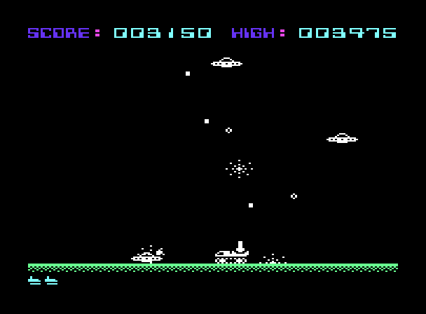

# Tank vs UAP (Commodore VIC-20)


<p align="center">
  &emsp;
  
</p>
<p align="center">
See <a href="https://www.youtube.com/watch?v=56ttMAsXZLo">YouTube</a> video, for recording with sound.
</p>

<br>

**Tank vs UAP** is a 6502 machine-language arcade game for the stock unexpanded **Commodore VIC-20**. **Tank vs UAP** was inspired by the original type-in **BASIC** game, **Tank vs UFO**, by *Duane Later*. The original type-in game, **Tank vs "UFO"**, could be found at the back of the VIC-20 user manual, along with a number of other games written by *Duane Later*.

**Tank vs UAP** retains the core sprit of *Later's* original **Tank vs UFO**, a single screen 2D tank trundling back and forth on the ground, shooting aliens out of the sky and dodging their bombs, ...but expanded, to offer a more arcade-like experience. 


***See also**, [Tank vs UFO 2.0](https://github.com/rohingosling/tank-vs-ufo-2.0): An assembly language rewrite of the D. Later's original 1981, BASIC type-in, **Tank vs UFO**.* 


## 📑 Contents

- [🔎 Overview](#-overview)
- [🚀 Quick Start](#-quick-start)
- [🎮 Controls](#-controls)
- [💾 Loading and Starting](#-loading-and-starting)
- [📂 Project Structure](#-project-structure)
- [💻 Building From Source](#-building-from-source)
- [🙋‍♂️ Acknowledgements](#-acknowledgements)
- [📄 License](#-license)


## 🔎 Overview

Just like in the original **Tank vs UFO**, you control a tank that patrols a single ground line at the bottom of the screen. However, unlike the original game, this tank is battling UAPs, instead than UFOs. Because, it's 2021, and the [ODNI Preliminary Assessment](https://www.dni.gov/files/ODNI/documents/assessments/Prelimary-Assessment-UAP-20210625.pdf) says *UFOs*, are like, *so* 1981.

The main goal of **Tank vs UAP** was to create a pixel-smooth, arcade-style, interpretation of the original BASIC version of **Tank vs UFO**.


### Features

| Feature | Description |
|---|---|
| Pixel Smooth | Pixel smooth graphics and animation. |
| Non-Blocking Events | Non-blocking animation events. |
| Aimed bombs | Each bomb vectors from the firing UAP toward the tank centre, with the gradient clamped to ±1.0. |
| Crashing UAPs | Crashing UAPs pose a collision threat to your tank. |
| Progressive difficulty | The number of simultaneous UAPs scales with score, from 1 up to a maximum of 4. <br>Surviving 4 UAPs is, challenging. |
| Arcade-Style Scoring | Arcade-Style score and high score. |

## 🚀 Quick Start

Want to just play **Tank vs UAP**? Download the disk image from the v1.0 release:

| File                | Download                                                                                  | Use case                                            |
|---------------------|-------------------------------------------------------------------------------------------|-----------------------------------------------------|
| `tank-vs-uap.d64`   | [download](https://github.com/rohingosling/tank-vs-uap/releases/download/v1.0/tank-vs-uap.d64) | Run in **VICE**, or load on a real **VIC-20** via **SD2IEC** / **Pi1541** / 1541 |

**Run in VICE (unexpanded VIC-20):**

```
xvic -memory none -autostart tank-vs-uap.d64
```

> The `-memory none` flag is required. By default **VICE** enables a 3K RAM expansion, which relocates the **BASIC** start address and prevents the disk-loaded program from landing at `$1001`. **Tank vs UAP** targets the stock unexpanded machine, so the expansion must be switched off.

**Run on real hardware (disk only):**

```
LOAD "TANK-VS-UAP",8,1
RUN
```

## 🎮 Controls

Same game-play controls as *Duane Later's* original **Tank vs UFO**.

| Key | Context | Action |
|---|---|---|
| `Z` | In game | Move the tank left while held (44 px/sec, PAL-calibrated). |
| `C` | In game | Move the tank right while held (44 px/sec). |
| `B` | In game | Fire the tank gun vertically. Reloads for 250 ms before the next shot. |
| Any key | Title screen (boot only) | Start play. |
| Any key | Game-over screen | Start a new game instantly (high score retained). |


## 💾 Loading and Starting

**Tank vs UAP** is **disk-only** for now. Tape is, unfortunately, not 'yet' supported.


### Real hardware (Commodore VIC-20)

Put `tank-vs-uap.d64` on an **SD2IEC**, **Pi1541**, or **1541 Ultimate** (or write it to a real floppy for a 1541 drive) as device 8, then at the **BASIC** prompt:

```
LOAD "TANK-VS-UAP",8,1
RUN
```

`LOAD "*",8,1` also works — the main program is the first file on the disk.

The **VIC-20** must be **unexpanded** (no 3K / 8K RAM cartridge fitted), because the program is laid out for the stock memory map with the screen at `$1E00` and the custom character set at `$1400`.


### VICE — run from the disk image

Run the `.d64` in `xvic` (the **VIC-20** emulator in the [**VICE**](https://vice-emu.sourceforge.io/) suite). From a terminal in the directory holding the disk image:

**Windows** (Command Prompt or PowerShell; use the full path to `xvic.exe` if **VICE**'s `bin` folder is not on `PATH`):

```
xvic.exe -memory none -autostart tank-vs-uap.d64
```

**Linux / macOS:**

```
xvic -memory none -autostart tank-vs-uap.d64
```

> The `-memory none` flag is required. By default **VICE** enables a 3K RAM expansion, which relocates the **BASIC** start address and prevents the disk-loaded program from landing at `$1001`. **Tank vs UAP** targets the stock unexpanded machine, so the expansion must be switched off.


### VICE — run from the `.prg` file

The bare `tank-vs-uap.prg` can be started directly, but the disk image must still be attached as drive 8. The game loads its code overlays and title banners from disk at boot. `-autostartprgmode 1` injects the `.prg` straight into RAM and types `RUN`, leaving the drive free for those loads.

**Windows:**

```
xvic.exe -memory none -autostartprgmode 1 -8 dist\tank-vs-uap.d64 -autostart build\tank-vs-uap.prg
```

**Linux / macOS:**

```
xvic -memory none -autostartprgmode 1 -8 dist/tank-vs-uap.d64 -autostart build/tank-vs-uap.prg
```


## 📂 Project Structure

```
src/                    6502 assembly source (Kick Assembler).
build/                  Build output (tank-vs-uap.prg + code overlays) and the pre-generated
                        banner data (banner-*.prg, banner-layout.asm, banner-resident.asm)
                        needed to assemble.
dist/                   Disk image (tank-vs-uap.d64). Disk only for now, no tape image 'yet'.
images/                 Screenshots.
```


## 💻 Building From Source

The project builds with two tools, on Windows, Linux, or macOS:

| Tool | Needs | Role |
|---|---|---|
| [**Kick Assembler**](http://www.theweb.dk/KickAssembler/) v5.x | A Java runtime (Java 8+) | Assembles `src/` into the `.prg` binaries. |
| [**VICE**](https://vice-emu.sourceforge.io/) 3.x | - | `c1541` packs the `.d64` disk image; `xvic` runs it. |

On Windows, **Kick Assembler** is a plain `KickAss.jar` download and **VICE** is a zip whose `bin` folder holds `c1541.exe` and `xvic.exe`. On Linux, install **VICE** from your package manager. On macOS, `brew install vice` provides both binaries. The commands below assume `KickAss.jar` at an example location and `c1541` / `xvic` reachable on `PATH`. ***Note:** substitute your own paths as needed.*


### 1. Assemble

Run from the project root. One invocation assembles the whole game: the main program plus all four disk-loaded code overlays. The `-libdir build` is required. `build/` holds the pre-generated banner data files (`banner-layout.asm`, `banner-resident.asm`, and the three `banner-*.prg` bitmaps) that are committed to the repository and imported by the source; the `-odir` path must be absolute.

**Windows** (Command Prompt; in PowerShell replace `%CD%` with `$PWD`):

```
java -jar C:\Programs\KickAssembler\KickAss.jar src\tank-vs-uap.asm -libdir src -libdir build -odir "%CD%\build" -o "%CD%\build\tank-vs-uap.prg"
```

**Linux / macOS:**

```
java -jar ~/kickassembler/KickAss.jar src/tank-vs-uap.asm -libdir src -libdir build -odir "$PWD/build" -o "$PWD/build/tank-vs-uap.prg"
```

This writes `tank-vs-uap.prg`, `overlay.prg`, `overlay2.prg`, `screens-overlay.prg`, and `resident.prg` into `build/`.


### 2. Pack the disk image

`c1541` formats a fresh disk and writes the program, the code overlays (single-letter disk names `o` / `p` / `s` / `r`), and the three title-screen banner bitmaps (`t` / `a` / `c`). Create `dist/` first if it does not exist (`mkdir dist`).

**Windows:**

```
c1541 -format "tank vs uap,tu" d64 dist\tank-vs-uap.d64 -write build\tank-vs-uap.prg "tank-vs-uap" -write build\overlay.prg "o" -write build\overlay2.prg "p" -write build\screens-overlay.prg "s" -write build\resident.prg "r" -write build\banner-title.prg "t" -write build\banner-author.prg "a" -write build\banner-controls.prg "c"
```

**Linux / macOS:**

```
c1541 -format "tank vs uap,tu" d64 dist/tank-vs-uap.d64 \
      -write build/tank-vs-uap.prg      "tank-vs-uap"    \
      -write build/overlay.prg          "o"              \
      -write build/overlay2.prg         "p"              \
      -write build/screens-overlay.prg  "s"              \
      -write build/resident.prg         "r"              \
      -write build/banner-title.prg     "t"              \
      -write build/banner-author.prg    "a"              \
      -write build/banner-controls.prg  "c"
```


### 3. Run

```
xvic -memory none -autostart dist/tank-vs-uap.d64
```


## 🙋‍♂️ Acknowledgements

| Author            | Tool / Source                                                                     |
|-------------------|-----------------------------------------------------------------------------------|
| Duane Later       | Original type-in BASIC version of **Tank vs UFO**. The inspiration for this game. |
| Mads Nielsen      | [**Kick&nbsp;Assembler**](http://www.theweb.dk/KickAssembler/)                    |
| The **VICE** Team | [**VICE**](https://vice-emu.sourceforge.io/)                                      |


## 📄 License

Released under the [MIT License](LICENSE) — Copyright © 2021 Rohin Gosling.
